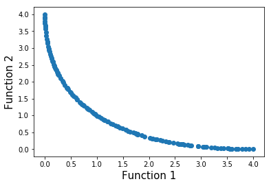
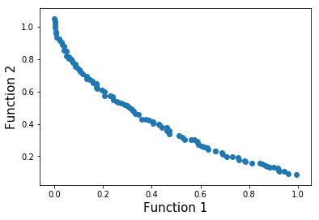
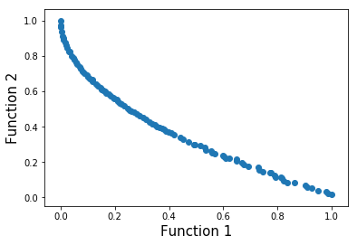

# NSGA-II Python
Implementation of NSGA-II algorithm in form of a python library.

This implementation can be used to solve multivariate (more than one dimensions) multi-objective optimization problem. The number of objectives and dimensions are not limited. Some critical operators are chosen as: Binary Tournament Selection, Simulated Binary Crossover and Polynomial Mutation. Note that we didn't start everything from scratch but modified the source code from [wreszelewski/nsga2](https://github.com/wreszelewski/nsga2). We are very thankful to Wojciech Reszelewski and Kamil Mielnik - authors of this original version. The following items are modified:
* Fix the crowding distance formula.
* Modify some parts of the code to apply to any number of objectives and dimensions.
* Modify the selection operator to Tournament Selection.
* Change the crossover operator to Simulated Binary Crossover.
* Change the mutation operator to Polynomial Mutation.

## Usage
1. Class **Problem**

    Defined in _problem.py_.

    Using to define a multi-objective problem.

    Arguments:
    * `objectives`: A list of functions, representing the objective functions.
    * `num_of_variables`: An integer, representing the number of variables.
    * `variables_range`: A list of tuples of two elements, representing the lower and upper bound of each respective variables.
    * `same_range`: A boolean argument, default = `False`. If true, the range of all variables are the same (this case `variables_range` has only one element), otherwise each variable has its own range.
    * `expand`: A boolean argument, default = `True`. If true, input of functions are treated as list of respective variables (e.x. `f(x,y,z)`), otherwise they are treated as a vector (e.x. `f([x1, x2, x3])`).

2. Class **Evolution**

    Defined in _evolution.py_.

    Using to run NSGA-II.

    1. Arguments:
        * `problem`: An object of class Problem.
        * `num_of_generations`: An integer, default = 1000, representing the number of generations.
        * `num_of_individuals`: An integer, default = 100, representing the number of individuals, a.k.a the population size.    
        * `num_of_tour_particips`: An integer, default = 2, representing the number of participants in tournament selection operator.
        * `tournament_prob`: A real number, default = 0.9, representing the probability used in tournament selection.
        * `crossover_param`: An integer, default = 2, representing the parameter used in simulated binary crossover.
        * `mutation_param`: An integer, default = 2, representing the paramenter used in polynomial mutation.
    2. Methods:
        * `evolve`:
            * Arguments: None.
            * Return: List of the best individuals in the last generation.

## Example
Examples about SCH problem and KUR problem are showed in _sch.py_ and _kur.py_.

In addition, the results of some popular multi-objective problems is demonstrated as belows:

* SCH 
* KUR 
* ZDT1 
* ZDT4 
* VIENNET 

## Authors
* Pham Ngo Gia Bao, Ho Chi Minh University of Technology
* Tram Loi Quan, Ho Chi Minh University of Technology
* A/Prof. Quan Thanh Tho, Ho Chi Minh University of Technology (advisor)
* A/Prof. Akhil Garg, Shantou University (advisor)

We are very thankful to A/Prof. Tho and A/Prof. Akhil for helping and guiding us to finish this work.
